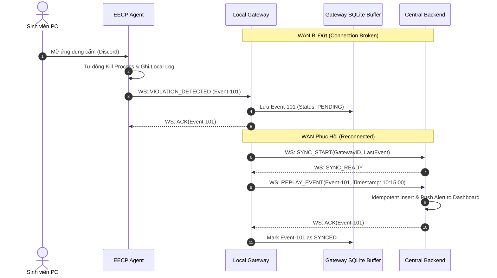
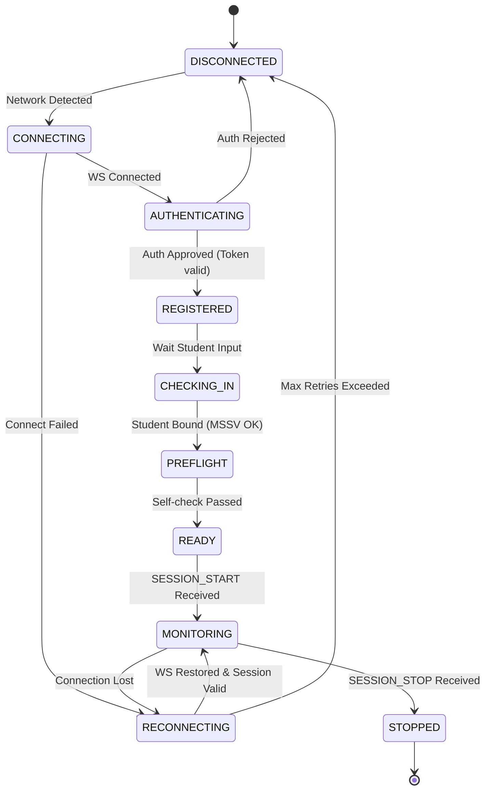
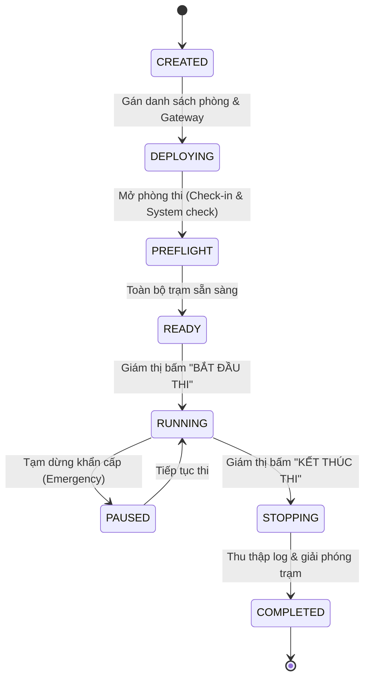
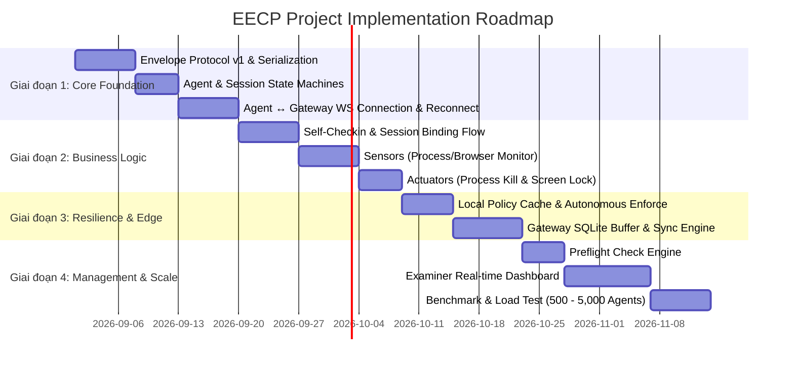

# EECP Architecture Specification v1.0 (Enhanced Baseline)
**Enterprise Exam Control & Proctoring Platform**

---

## 0. Architecture Decision Summary

| Quyết định | Giải pháp Chốt | Ghi chú kỹ thuật |
| :--- | :--- | :--- |
| **Client trên máy trạm** | EECP Agent (Python / Windows) | Chạy background, có khả năng tự hành (Autonomous) |
| **Kết nối Agent ↔ Gateway** | WebSocket (Outbound LAN) | Realtime, binary/json envelope protocol |
| **Kết nối Gateway ↔ Backend** | Persistent Outbound WS / gRPC Stream | Bidirectional push, vượt qua NAT/Firewall trường học |
| **Kiến trúc phòng thi** | Local-first / Edge Gateway | Cô lập sự cố phòng thi, hoạt động độc lập khi rớt WAN |
| **Local Gateway Durability** | Local SQLite / Circular Buffer | Lưu trữ và Replay sự kiện khi WAN phục hồi |
| **Business Authority** | Central EECP Backend | Quản lý toàn bộ định danh, session, policy & audit |
| **Database** | PostgreSQL | Lưu trữ dữ liệu quan trọng (Session, Agent, Violation, Audit) |
| **Presence Store** | In-Memory (MVP) → Redis (Scale) | Quản lý Heartbeat/Online state, không ghi vào PostgreSQL |
| **Anti-Tamper & Enforcement** | Administrator Privileges + Watchdog (V1.5) | Chặn phím tắt, chặn Task Manager, auto-restart tiến trình |
| **Exam Web Boundary** | Third-party / External System | EECP **không** can thiệp đề thi, bài thi, nộp bài, chấm điểm |
| **Identity Model** | `Agent ID` + Hardware Fingerprint + Token | Không dùng IP làm định danh |
| **Reliability** | At-least-once + Idempotent Processing | Dựa trên `message_id` / `event_id` |
| **Scale Validation Target** | 500 → 1,000 → 2,000 → 5,000 Agents | Xác định breaking point & năng lực thực tế |

---

## 1. System Context & Boundaries

EECP đóng vai trò là hạ tầng giám sát, bảo mật và thực thi chính sách thi tập trung (Security & Proctoring Infrastructure), hoạt động song song nhưng tách biệt hoàn toàn với hệ thống thi của bên thứ ba.

```
                    ┌──────────────────────────┐
                    │  THIRD-PARTY EXAM WEB    │
                    │  (Moodle, Canvas, Web)   │
                    │  - Question / Answers    │
                    │  - Exam Submission       │
                    └────────────┬─────────────┘
                                 │
                             Student
                                 │
┌────────────────────────────────┼─────────────────────────┐
│                    STUDENT PC  │                         │
│                                ▼                         │
│  ┌───────────────────┐       ┌────────────────────────┐  │
│  │ Third-party Exam  │       │      EECP Agent        │  │
│  │ Web / Browser     │       │                        │  │
│  └───────────────────┘       │ - Sensor (Detect)      │  │
│                              │ - Actuator (Enforce)   │  │
│                              │ - Local Policy Cache   │  │
│                              │ - Local Event Queue    │  │
│                              └───────────┬────────────┘  │
└──────────────────────────────────────────┼───────────────┘
                                           │
                                  WebSocket (LAN)
                                           │
                                           ▼
                                  ┌─────────────────┐
                                  │  Exam Gateway   │
                                  │  (Local Edge)   │
                                  │                 │
                                  │ - Presence      │
                                  │ - Local Buffer  │
                                  │ - Sync Engine   │
                                  └────────┬────────┘
                                           │
                          Persistent WS / gRPC (Outbound)
                                           │
                                           ▼
                                  ┌─────────────────┐
                                  │  EECP Backend   │
                                  │  (Central Hub)  │
                                  │                 │
                                  │ - Session & Auth│
                                  │ - Policy Engine │
                                  │ - Audit Logs    │
                                  └────────┬────────┘
                                           │
                                           ▼
                                  ┌─────────────────┐
                                  │ Examiner        │
                                  │ Dashboard (Web) │
                                  └─────────────────┘
```

### Ranh giới trách nhiệm (Boundary Rules):
- **EECP KHÔNG quản lý**: Đề thi, nội dung câu hỏi, bài làm của sinh viên, nộp bài, chấm điểm, cơ sở dữ liệu bài thi.
- **EECP QUẢN LÝ**: Máy trạm (Machine/Workstation), Agent lifecycle, ghép nối Sinh viên ↔ Máy trạm, Context ca thi, Giám sát tiến trình/mạng, Phát hiện vi phạm, Cưỡng chế chính sách (Khóa máy/Tắt ứng dụng), Ghi nhận bằng chứng & Nhật ký kiểm toán (Audit).

---

## 2. Container Architecture (C4 Model)

```
                              EECP Backend (Central)
                                        │
             ┌──────────────────────────┼──────────────────────────┐
             │                          │                          │
             ▼                          ▼                          ▼
       Agent Service              Session Service          Monitoring Service
    (Identity, Registry)       (Binding, Lifecycle)        (Violation, Alert)
             │                          │                          │
             └──────────────────────────┼──────────────────────────┘
                                        │
                                  Policy Engine
                                        │
                                  Authorization
                                        │
                                   Audit Logger
                                        │
                      ┌─────────────────┴─────────────────┐
                      ▼                                   ▼
              PostgreSQL Database                  Presence Store
        (Agents, Sessions, Violations,         (Active Connections,
             Policies, Audit Logs)            Heartbeat State in RAM/Redis)
```

---

## 3. Detailed Edge & Deployment Architecture

```
                            CENTRAL CLOUD / SERVER
                       ┌──────────────────────────────┐
                       │        EECP Backend          │
                       │     (FastAPI / Go Core)      │
                       │  - PostgreSQL + Redis Store  │
                       └──────────────┬───────────────┘
                                      ▲
                                      │ Persistent Outbound Stream
                                      │ (WebSocket / gRPC)
                 ═════════════════════╪═════════════════════
                                      │ (Firewall / NAT Safe)
                               EXAM ROOM (LAN)
                       ┌──────────────┴───────────────┐
                       │      Local Exam Gateway      │
                       │                              │
                       │ ├─ Outbound WS Client (WAN)  │
                       │ ├─ Inbound WS Server (LAN)   │
                       │ ├─ Local RAM Presence Table  │
                       │ └─ Local SQLite Event Buffer │
                       └──────────────┬───────────────┘
                                      │
                         Gigabit LAN (WebSocket)
                                      │
         ┌────────────────────────────┼────────────────────────────┐
         │                            │                            │
 ┌───────▼────────┐           ┌───────▼────────┐           ┌───────▼────────┐
 │   PC-01        │           │   PC-02        │           │   PC-N         │
 │ ┌────────────┐ │           │ ┌────────────┐ │           │ ┌────────────┐ │
 │ │ Third-Party│ │           │ │ Third-Party│ │           │ │ Third-Party│ │
 │ │ Exam Web   │ │           │ │ Exam Web   │ │           │ │ Exam Web   │ │
 │ └────────────┘ │           │ └────────────┘ │           │ └────────────┘ │
 │ ┌────────────┐ │           │ ┌────────────┐ │           │ ┌────────────┐ │
 │ │ EECP Agent │ │           │ │ EECP Agent │ │           │ │ EECP Agent │ │
 │ │ (Autonomous│ │           │ │ (Autonomous│ │           │ │ (Autonomous│ │
 │ │  Enforce)  │ │           │ │  Enforce)  │ │           │ │  Enforce)  │ │
 │ └────────────┘ │           │ └────────────┘ │           │ └────────────┘ │
 └────────────────┘           └────────────────┘           └────────────────┘
```

---

## 4. Giải quyết 5 Thách thức Kỹ thuật Trọng yếu (Specialized Solutions)

### 4.1. Giao thức Gateway ↔ Central Backend (Push lệnh Real-time qua NAT/Firewall)
* **Vấn đề**: Gateway phòng thi nằm sau Router/NAT/Firewall của trường, Backend không thể gọi Inbound HTTP trực tiếp xuống Gateway.
* **Giải pháp chuẩn**:
  - Khi khởi động, Local Gateway chủ động thiết lập **1 kết nối Outbound Persistent WebSocket (hoặc gRPC Bi-directional Stream)** lên Central Backend qua cổng chuẩn `443 (HTTPS/WSS)`.
  - Kết nối này đóng vai trò là đường truyền 2 chiều (Multiplexed Control & Telemetry Tunnel):
    - **Downlink (Backend → Gateway)**: Đẩy tức thì (sub-second latency) các lệnh điều khiển như `LOCK_ALL`, `START_SESSION`, `POLICY_UPDATE`, `FORCE_SUBMIT`.
    - **Uplink (Gateway → Backend)**: Đẩy dữ liệu trạng thái gộp (Aggregated Presence), các bản tin `VIOLATION_DETECTED` và `AUDIT_EVENT`.

### 4.2. Khả năng chịu lỗi mất mạng WAN (Gateway Offline Durability & Sync Engine)
* **Vấn đề**: Cáp quang từ phòng thi lên Central Server bị gián đoạn trong lúc đang thi.
* **Giải pháp chuẩn**:
  - **Local SQLite / WAL Event Buffer**: Tại Gateway, mọi sự kiện vi phạm hoặc thay đổi trạng thái quan trọng (`VIOLATION_DETECTED`, `STATUS_CHANGE`) được ghi ngay vào hàng đợi SQLite cục bộ với trạng thái `PENDING`.
  - **Presence Isolation**: Trạng thái Online của máy trạm vẫn được cập nhật tại Gateway LAN.
  - **Replay & Sync Mechanism**: Khi phát hiện kết nối WAN với Central Backend phục hồi:
    1. Gateway thực hiện bắt tay `SYNC_START` kèm `last_synced_event_id`.
    2. Đẩy tuần tự các sự kiện trong hàng đợi kèm **timestamp gốc (Original Event Timestamp)**.
    3. Backend xử lý Idempotent và trả về `ACK(event_ids)`.
    4. Gateway đánh dấu `SYNCED` trong SQLite để dọn dẹp bộ nhớ.



### 4.3. Cơ chế tự hành của Agent (Autonomous Local Enforcement)
* **Vấn đề**: Sinh viên cố tình rút dây mạng máy trạm hoặc ngắt card mạng để qua mặt hệ thống.
* **Giải pháp chuẩn**:
  - **Local Policy In-Memory Cache**: Khi nhận lệnh `START_MONITORING` hoặc `POLICY_UPDATE`, Agent phân giải danh sách (Blacklist process, Whitelist website, Clipboard rules) và lưu trực tiếp trong RAM của Agent.
  - **Autonomous Enforcement Loop**: Dù mất kết nối mạng (`DISCONNECTED` hoặc `RECONNECTING`), vòng lặp giám sát cục bộ (Local Monitor Worker) vẫn chạy ngầm:
    - Phát hiện tiến trình cấm $\rightarrow$ Lập tức thực thi lệnh `Terminate/Kill`.
    - Ghi nhận vi phạm vào **Agent Local Event Queue** trên đĩa.
  - **Reconnection Flush**: Ngay khi cắm lại dây mạng và kết nối lại Gateway thành công, Agent gửi lệnh `FLUSH_EVENTS` để đồng bộ toàn bộ sự kiện vi phạm đã ghi nhận trong lúc offline.

### 4.4. Quy trình Ghép máy & Sinh viên (Self-Checkin Binding Flow)
* **Luồng chuẩn hóa cho V1**:
  1. Máy tính khởi động, Agent chạy ngầm và hiển thị màn hình Check-in (Lock Screen / Overlay).
  2. Sinh viên ngồi vào máy, nhập **Mã số sinh viên (MSSV)** và **Mã ca thi (Session Code)**.
  3. Agent gửi bản tin `JOIN_SESSION(MSSV, SessionCode, HardwareFingerprint)` lên Gateway $\rightarrow$ Backend.
  4. Backend kiểm tra:
     - MSSV có trong danh sách ca thi không?
     - MSSV này đã đăng nhập ở máy khác chưa?
     - Máy này đã có ai đăng nhập chưa?
  5. Nếu hợp lệ: Backend trả về `BINDING_SUCCESS`, gán chặt `1 MSSV ↔ 1 AgentID` cho ca thi, mở khóa màn hình và kích hoạt `PREFLIGHT`.
  6. **Cơ chế Đổi máy (Supervisor Override)**: Nếu máy bị hỏng phần cứng giữa giờ, Giám thị bấm "Unbind / Cho phép chuyển máy" trên Dashboard, sinh viên chuyển sang máy dự phòng và đăng nhập lại bằng MSSV của mình.

### 4.5. Mô hình Bảo mật & Chống can thiệp (Anti-Tamper & Security Model)
* **Quyền thực thi (Privilege Level)**:
  - Agent chạy dưới quyền **Administrator / Local System** (thông qua Windows Service hoặc Task Scheduler lúc boot).
* **Cơ chế chặn thao tác phá hoại (V1)**:
  - **Hook bàn phím / Global Key Interception**: Vô hiệu hóa `Alt + Tab`, `Alt + F4`, `Windows Key`, `Ctrl + Shift + Esc` (khi đang trong phiên thi).
  - **Process Protection**: Vô hiệu hóa mở Task Manager (`DisableTaskMgr` Registry policy trong thời gian thi) để tránh sinh viên bấm `End Task`.
* **Mô hình Watchdog kép (Roadmap V1.5)**:
  - Gồm 2 tiến trình: `EECP_Core_Agent` và `EECP_Watchdog_Service`.
  - Hai tiến trình liên tục trao đổi IPC Heartbeat. Nếu một trong hai bị kill bất thường, tiến trình còn lại lập tức tái khởi động tiến trình kia trong < 500ms và gửi ngay cảnh báo khẩn `AGENT_TAMPER_DETECTED` về Gateway.

---

## 5. Agent Architecture (Internal Subsystems)

```
agent/
│
├── application/
│   ├── lifecycle/              # Khởi tạo, shutdown, transition state
│   ├── session/                # Quản lý MSSV, Session context, Check-in
│   └── command_dispatcher/     # Tiếp nhận và định tuyến lệnh từ Gateway
│
├── communication/
│   ├── websocket_client.py     # Kết nối Outbound WebSocket
│   ├── protocol_envelope.py    # Đóng gói và giải mã Envelope v1
│   ├── reconnect_handler.py    # Backoff + Jitter reconnect
│   └── heartbeat_worker.py     # Định kỳ gửi ping/heartbeat
│
├── identity/
│   ├── agent_identity.py       # Quản lý Agent UUID
│   ├── credential_store.py     # Lưu trữ Session Token tạm thời
│   └── hardware_fingerprint.py # Băm thông tin CPU ID, Mainboard, MAC
│
├── monitoring/ (Sensors)
│   ├── process_monitor.py      # Quét danh sách tiến trình đang chạy
│   ├── browser_monitor.py      # Giám sát URL trình duyệt & tab
│   ├── system_monitor.py       # Giám sát CPU/RAM/Network/Màn hình phụ
│   └── violation_detector.py   # Đối chiếu với Policy Rules
│
├── enforcement/ (Actuators)
│   ├── process_controller.py   # Kill/Suspend tiến trình vi phạm
│   ├── lock_controller.py      # Khóa màn hình máy trạm
│   └── local_policy_cache.py   # Cache policy in-memory để tự hành
│
├── reliability/
│   ├── local_event_queue.py    # Hàng đợi lưu sự kiện khi mất mạng
│   ├── retry_manager.py        # Logic thử lại
│   └── deduplicator.py         # Tránh trùng lặp bản tin gửi
│
└── infrastructure/
    ├── windows/                # Win32 API, Hooking, Registry Policy
    ├── logging/                # Structured JSON file logger
    └── config.py               # Cấu hình Gateway IP, Timeout, v.v.
```

---

## 6. Finite State Machines (FSM)

### 6.1. Agent State Machine



### 6.2. Exam Session State Machine



---

## 7. Protocol Envelope Specification v1

Mọi bản tin giữa **Agent ↔ Gateway ↔ Backend** đều sử dụng định dạng Envelope chuẩn:

```json
{
  "version": 1,
  "message_id": "MSG-9f8e-4a2b-8123-abcdef123456",
  "type": "VIOLATION_DETECTED",
  "timestamp": "2026-08-31T10:20:31.125Z",
  "sender": {
    "role": "AGENT",
    "id": "AGT-ROOM_A-PC037"
  },
  "session_id": "SES-2026-KHOA-001",
  "payload": {
    "student_id": "20110001",
    "violation_code": "FORBIDDEN_PROCESS",
    "severity": "CRITICAL",
    "evidence": {
      "process_name": "discord.exe",
      "pid": 4812,
      "window_title": "Discord - General Voice",
      "path": "C:\\Users\\Admin\\AppData\\Local\\Discord\\app-1.0.9000\\Discord.exe"
    },
    "action_taken": "PROCESS_TERMINATED"
  }
}
```

### Danh mục bản tin phân theo nhóm chức năng:

| Nhóm | Message Type | Chiều | Ý nghĩa |
| :--- | :--- | :---: | :--- |
| **Lifecycle & Auth** | `AGENT_HELLO` | Agent $\rightarrow$ GW | Gửi Fingerprint & Hardware specs xin kết nối |
| | `AUTH_CHALLENGE` | GW $\rightarrow$ Agent | Gửi nonce/challenge xác thực |
| | `AUTH_RESPONSE` | Agent $\rightarrow$ GW | Trả về chữ ký / token xác thực |
| | `AUTH_SUCCESS` | GW $\rightarrow$ Agent | Xác thực thành công, trả về AgentID & Config |
| **Session & Check-in** | `STUDENT_CHECKIN` | Agent $\rightarrow$ GW | Gửi MSSV & SessionCode xin ghép máy |
| | `CHECKIN_RESULT` | GW $\rightarrow$ Agent | Kết quả duyệt (ACCEPTED / REJECTED) |
| | `PREFLIGHT_STATUS`| Agent $\rightarrow$ GW | Báo cáo kết quả kiểm tra phần mềm/mạng máy trạm |
| **Monitoring & Telemetry**| `HEARTBEAT` | Agent $\rightarrow$ GW | Báo trạng thái sống (RAM, CPU, Active Window) |
| | `VIOLATION_DETECTED`| Agent $\rightarrow$ GW | Phát hiện vi phạm (gửi kèm chứng cứ) |
| | `STATUS_UPDATE` | Agent $\rightarrow$ GW | Cập nhật thay đổi trạng thái (VD: cắm USB) |
| **Control (Lệnh)** | `START_SESSION` | GW $\rightarrow$ Agent | Bắt đầu thi, áp dụng Policy, bật Sensor |
| | `STOP_SESSION` | GW $\rightarrow$ Agent | Kết thúc thi, gỡ bỏ Policy |
| | `POLICY_UPDATE` | GW $\rightarrow$ Agent | Cập nhật Blacklist/Whitelist ngay lập tức |
| | `LOCK_WORKSTATION`| GW $\rightarrow$ Agent | Khóa màn hình máy trạm khẩn cấp |
| | `UNLOCK_WORKSTATION`| GW $\rightarrow$ Agent | Mở khóa màn hình máy trạm |
| **Reliability & Sync** | `ACK` / `NACK` | 2 chiều | Xác nhận đã nhận & xử lý thành công bản tin |
| | `SYNC_START` | GW $\rightarrow$ Backend | Bắt đầu đồng bộ sự kiện sau khi mất mạng |
| | `REPLAY_EVENT` | GW $\rightarrow$ Backend | Gửi lại các sự kiện đã lưu đệm |

---

## 8. Failure & Resilience Matrix

| Tình huống Lỗi | Hành vi Dự kiến của Hệ thống | Cơ chế Khắc phục |
| :--- | :--- | :--- |
| **Agent mất mạng LAN 3s** | Tiếp tục giám sát cục bộ. Tự động kết nối lại. | Backoff + Jitter Reconnect |
| **Agent mất mạng LAN kéo dài** | Tự hành: Tiếp tục kill app cấm dựa trên In-Memory Policy Cache. Lưu vi phạm vào Local Queue. | Dashboard Gateway báo `OFFLINE`. Đồng bộ lại khi có mạng. |
| **Sinh viên rút dây mạng** | Máy tiếp tục bị khóa/giám sát theo Policy. Cảnh báo hiển thị trên Gateway & Dashboard. | Agent autonomous enforcement. |
| **Sinh viên cố kill Agent** | Process Hook & Disable Task Manager ngăn chặn. Watchdog Service khởi động lại ngay. | Win32 API Restrictions + Watchdog |
| **Gateway phòng thi bị crash/restart** | Tất cả Agent tự động chờ và reconnect. Central Backend phát hiện Gateway timeout. | Exponential Backoff + Re-handshake |
| **Mất kết nối WAN (Gateway $\leftrightarrow$ Central)** | Phòng thi vẫn diễn ra bình thường. Gateway đệm toàn bộ vi phạm vào Local SQLite. | Gateway Sync Engine tự động Replay khi có WAN lại. |
| **Central Backend bị restart** | Gateway tự động reconnect. Dữ liệu trạng thái phòng thi không bị mất nhờ Presence Store. | Gateway out-of-sync recovery. |
| **Sự cố gửi trùng bản tin (Network duplicate)** | Backend/Gateway lọc trùng dựa trên `message_id`. | Idempotent Event Processing. |
| **Hỏng máy trạm giữa giờ** | Giám thị thực hiện thao tác `Transfer Seat / Unbind` trên Dashboard. Sinh viên sang máy mới gõ MSSV. | Session Binding Migration |

---

## 9. Performance Target & Benchmarking Framework

Hệ thống được thiết kế để vượt qua các bài kiểm thử tải khắt khe theo từng giai đoạn:

```
[Thang đo tải]:  500 Agents  ──►  1,000 Agents  ──►  2,000 Agents  ──►  5,000 Agents (Breaking point test)
```

### Kịch bản Benchmark chính thức:
1. **S1 (Steady State)**: 2,000 Agents gửi Heartbeat chu kỳ 5 giây, truyền telemetry CPU/RAM. Đo độ ổn định RAM/CPU của Gateway và Central Backend.
2. **S2 (Mass Registration Burst)**: 2,000 Agents kết nối và đăng nhập đồng loạt trong vòng 60 giây khi bắt đầu ca thi.
3. **S3 (Mass Violation Storm)**: Giả lập 2,000 máy đồng loạt kích hoạt 1 tiến trình cấm. Đo độ trễ từ lúc phát hiện đến khi Dashboard hiển thị cảnh báo.
4. **S4 (Mass Emergency Broadcast)**: Giám thị phát lệnh `LOCK ALL` tới 2,000 máy trạm. Đo độ trễ lan truyền lệnh (Target: P95 < 500ms).
5. **S5 (Network Partition & Resync)**: Ngắt kết nối WAN 10 phút, kích hoạt 10,000 sự kiện vi phạm giả lập, sau đó mở lại WAN và đo thời gian đồng bộ hoàn tất.

### Bảng Chỉ tiêu Chất lượng Dịch vụ (SLA Targets):

| Chỉ số (Metric) | Tiêu chuẩn Đạt (Target) |
| :--- | :--- |
| **Tỷ lệ kết nối Agent thành công** | $\ge 99.9\%$ |
| **Tỷ lệ thất thoát Heartbeat** | $< 0.1\%$ |
| **Độ trễ phát hiện vi phạm $\rightarrow$ Dashboard** | $P95 < 300\text{ ms}$ (trong cùng LAN) / $P95 < 800\text{ ms}$ (qua WAN) |
| **Độ trễ truyền lệnh Giám thị $\rightarrow$ Máy trạm** | $P95 < 200\text{ ms}$ (Broadcast) |
| **Thời gian tự động kết nối lại (Reconnect)** | $P95 < 3\text{ giây}$ |
| **Tỷ lệ thất thoát sự kiện quan trọng (Event Loss)** | **Tuyệt đối bằng 0** (Được đảm bảo bởi Durable Queue) |
| **Sự kiện trùng lặp lưu vào DB** | **0** (Idempotency Filter) |

---

## 10. Roadmap Triển khai Chi tiết


